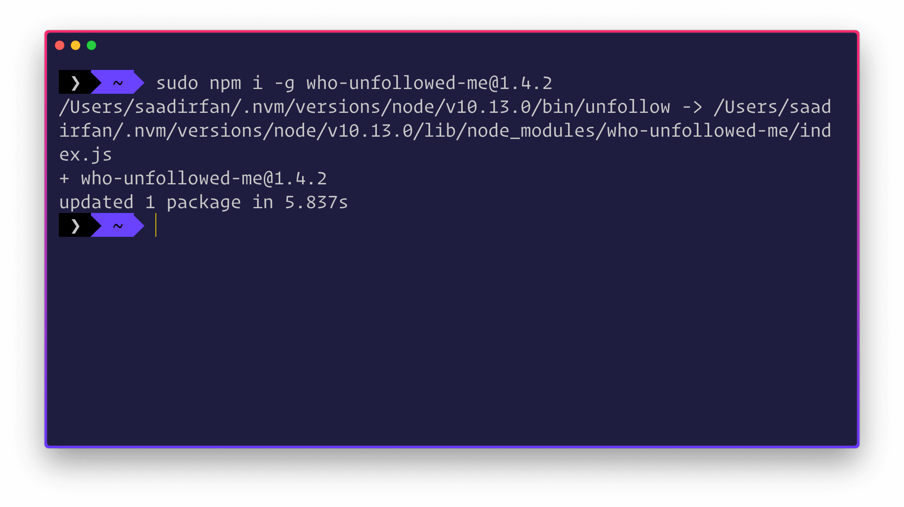
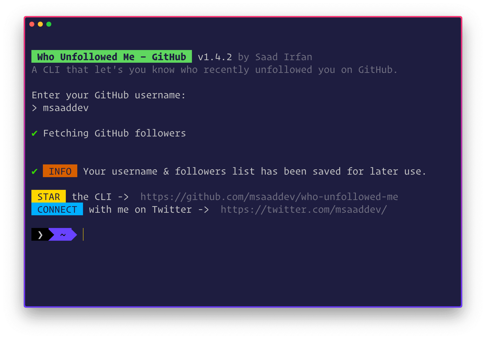
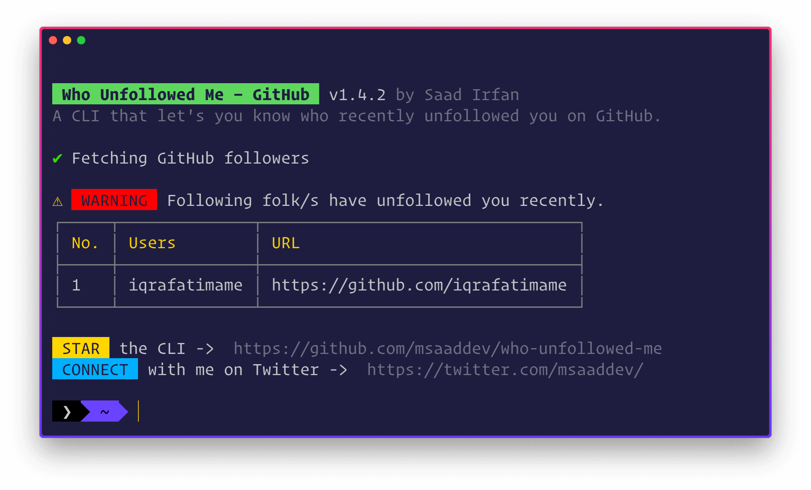
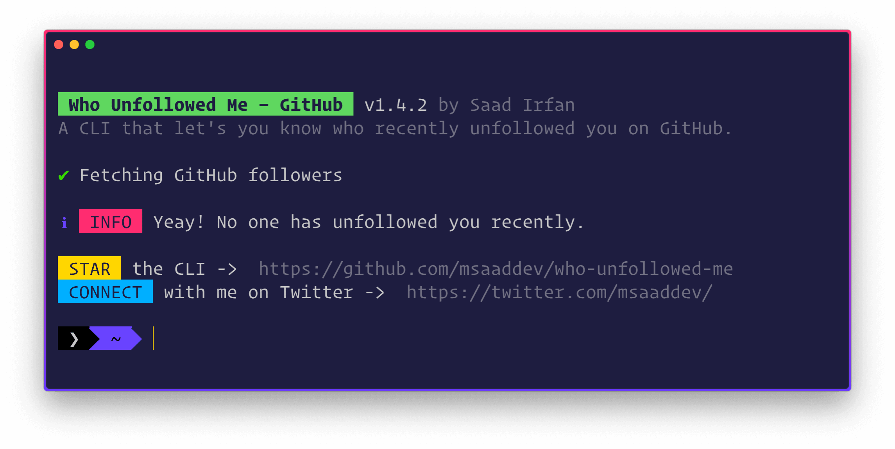

<div align="center">
	<h1>😠 who-unfollowed-me<br>
	
	
	
	</h1>
</div>

> A CLI that let's you know who recently unfollowed you on GitHub.

## 🎩 INSTALLATION

Install the CLI globally. If you are Windows user, run your Command Prompt or Terminal as Administrator. If you are macOS user, add `sudo` before the following command.

```sh
npm i -g who-unfollowed-me
```


## ⚙️ USAGE

You need to run the following command in your terminal.

```sh
gtunfollow
```

When you run the CLI for the first time, it will ask you to enter your GitHub username.



After that, whenever you run the CLI again, it will show you if anyone has recently unfollowed you or not.



If no one has unfollowed you, the CLI will also let you know this.



> If you are a Windows user, make sure that whenever you run the CLI, first run your Terminal or Command Prompt as Administrator.

## 👨🏻‍💻 AUTHOR

Howdy, you! This is [Saad Irfan](http://msaad.dev/), an aspiring JavaScript developer, former Google Developer Student Club's Lead, Microsoft Learn Student Ambassador, and an undergrad student. You can read more about me [here](https://github.com/msaaddev/msaaddev).

<div>
<a href="https://twitter.com/msaaddev">
  
</a>
<a href="https://www.linkedin.com/in/msaaddev/">
  
</a>
<a href="https://www.facebook.com/msaaddev/">
  
</a>
<a href="https://www.instagram.com/msaaddev">
  
</a>
</div>
<br>

## 🔑 LICENSE

- MIT
